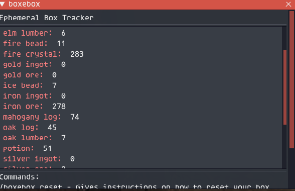

This addon keeps track the contents of your ebox on CatseyeXi for Crystal Warriors.

Each time you check, take something out of or put something into ebox, the count tracking each item will be updated.

If you have never accessed an item in the ebox it won't know how many you have

To install, copy the boxebox folder into your addons folder

Usage:
load addon:
/addon load boxebox 

To show the gui for the contents of your box:
/boxebox show

To hide the boxebox gui:
/boxebox hide

To show instructions on how to reset your box contents:
/boxebox reset

Example image:

